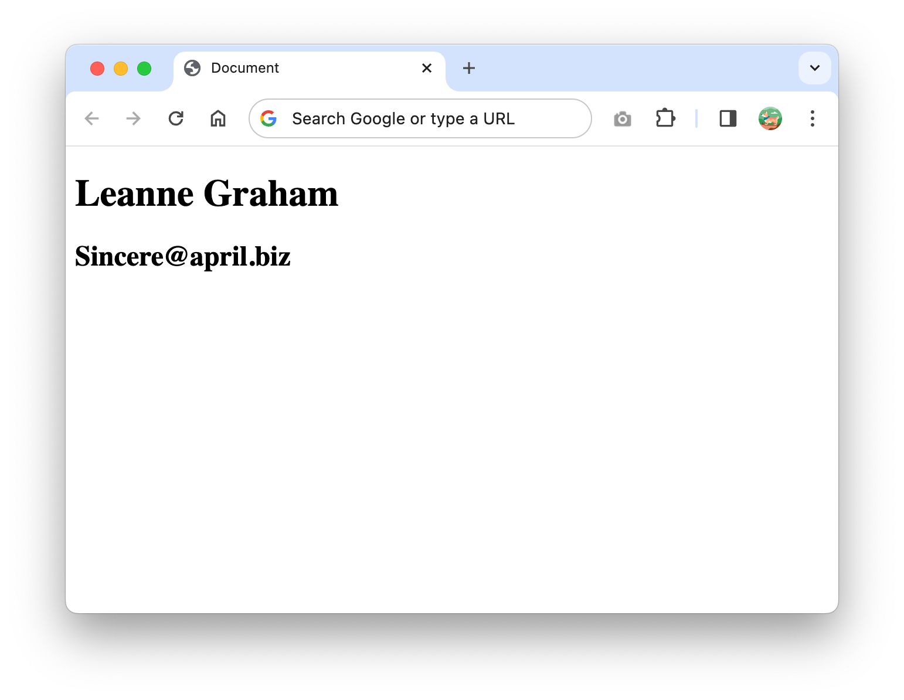

# GET requests

## ¿Cómo mandar una petición GET usando Fetch API?

La petición GET es una solicitud HTTP que se utiliza para solicitar datos específicos de una API cuando así se necesita.
En el siguiente ejemplo, accederemos a una URL ficticia ubicada en https://jsonplaceholder.typicode.com para solicitar un usuario registrado en el sitio:

```
fetch('https://jsonplaceholder.typicode.com/users/1')
  .then(respuesta => console.log(respuesta))
  .catch(error => console.log(error));
```
- Mandamos una petición GET usando Fetch API


El código anterior dará la siguiente respuesta:


Respuesta de la petición HTTP

Aquí puede ver que la propiedad del cuerpo contiene un ReadableStream. Para usar ReadableStream en nuestra aplicación JavaScript, necesitamos convertirlo para llamar al método json():

```
fetch('https://jsonplaceholder.typicode.com/users/1')
  .then(respuesta => respuesta.json())
  .then(datos => console.log(datos))
```

- Convertir la respuesta a JSON usando el método json()

El método json() convierte ReadableStream en un objeto JavaScript. La variable de datos anterior se imprimirá de la siguiente manera:

```
{
  "id": 1,
  "name": "Leanne Graham",
  "username": "Bret",
  "email": "Sincere@april.biz",
  "address": {
    "street": "Kulas Light",
    "suite": "Apt. 556",
    "city": "Gwenborough",
    "zipcode": "92998-3874",
    "geo": {
      "lat": "-37.3159",
      "lng": "81.1496"
    }
  },
  "phone": "1-770-736-8031 x56442",
  "website": "hildegard.org",
  "company": {
    "name": "Romaguera-Crona",
    "catchPhrase": "Multi-layered client-server neural-net",
    "bs": "harness real-time e-markets"
  }
}
```

- La petición regresa un objeto de JavaScript

Ahora que tiene el objeto de datos, puede utilizar este valor de la forma que desee. Por ejemplo, si desea mostrar el nombre de usuario y el correo electrónico en HTML, así es como lo hace:

```
<body>
  <h1 id='nombre-usuario'>Esperando por datos</h1>
  <h2 id='correo-usuario'>Esperando por datos</h1>
  <script>
    fetch('https://jsonplaceholder.typicode.com/users/1')
      .then(respuesta => respuesta.json())
      .then(datos => {
        document.querySelector('#nombre-usuario').textContent = datos.name
        document.querySelector('#correo-usuario').textContent = datos.email
      })
  </script>
</body>
```

- Mostrnado datos de la petición Fetch en HTML

En el código anterior, la API Fetch se ejecutará tan pronto como el navegador cargue el documento HTML.

Después de procesar la respuesta en un objeto de datos, JavaScript cambiará el texto de los elementos ``` <h1> y <h2> ``` anteriores para reflejar el nombre y el correo electrónico del usuario.

Si ejecuta el código anterior, obtendrá el siguiente resultado:


Salida de la petición Fetch en el navegador
Y así es como envía una solicitud GET usando Fetch y muestra los datos devueltos en HTML.

Tenga en cuenta que, según la petición que solicite, una API puede devolver un tipo diferente de datos.

En este ejemplo, la API typicode devuelve un objeto, pero también puede obtener una matriz cuando solicita más de una unidad de datos.

Si accede a la URL en https://jsonplaceholder.typicode.com/users, verá que la API responde con un arreglo de objetos.

Necesita conocer el tipo de datos devuelto por la API para manejarlo correctamente.

# Referencias 

https://www.freecodecamp.org/espanol/news/javascript-fetch-api-para-principiantes/