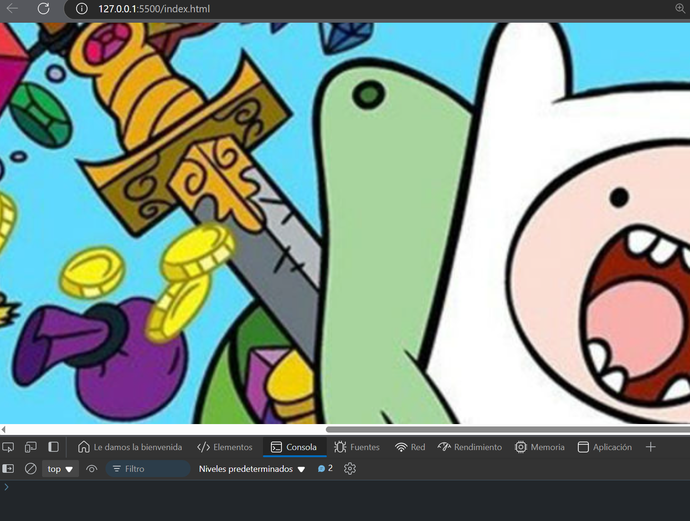

# Ejercicio 1 

Descargar una imagen y mostrarla en la página

### Respuesta 

```javascript
async function fetchImage() {
    try {
      const response = await fetch('https://ksassets.timeincuk.net/wp/uploads/sites/55/2019/10/at.jpg');
      const blob = await response.blob();
      const img = document.createElement('img');
      img.src = URL.createObjectURL(blob);
      document.body.appendChild(img);
    } catch (error) {
      console.error('Error al cargar la imagen:', error);
    }
  }
  
  fetchImage();
```

### Explicación:

- `fetch('https://via.placeholder.com/150'):` Realiza una solicitud GET a la URL de la imagen.
- `response.blob():` Convierte la respuesta en un objeto Blob que contiene los datos de la imagen.
- `document.createElement('img'):` Crea un nuevo elemento de imagen `()`.
- URL.createObjectURL(blob): Crea una URL temporal para el blob, que se asigna como el src de la imagen.
- document.body.appendChild(img): Agrega la imagen al cuerpo del documento HTML.

### Resultado


