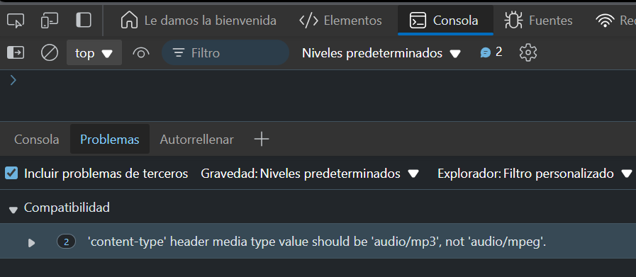

# Ejercicio 2

Descargar un archivo de audio y reproducirlo

### Respuesta

```javascript
async function fetchAudio() {
    try {
      const response = await fetch('https://files.freemusicarchive.org/storage-freemusicarchive-org/music/WFMU/Broke_For_Free/Directionless_EP/Broke_For_Free_-_01_-_Night_Owl.mp3');
      const blob = await response.blob();
      const audio = new Audio(URL.createObjectURL(blob));
      audio.play();
    } catch (error) {
      console.error('Error al cargar el audio:', error);
    }
  }
  
  fetchAudio();
```

### Explicación:

- fetch('https://www.soundhelix.com/examples/mp3/SoundHelix-Song-1.mp3'): Solicita el archivo de audio.
- response.blob(): Obtiene el blob del archivo de audio.
- new Audio(URL.createObjectURL(blob)): Crea un objeto Audio utilizando la URL del blob.
- audio.play(): Inicia la reproducción del audio.
### Resultado


