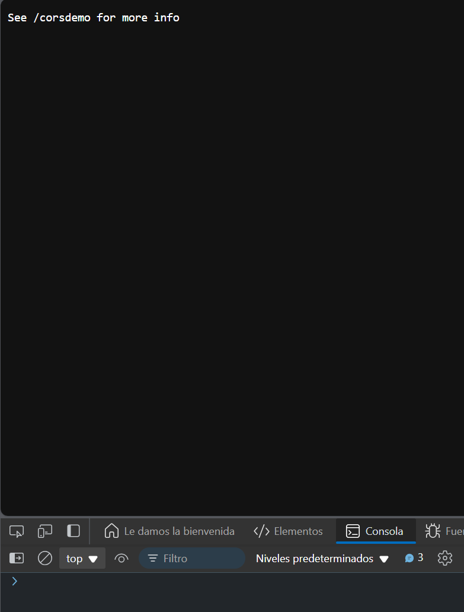

# Ejercicio 3

Descargar un archivo PDF y abrirlo en una nueva pestaña

### Respuesta 

```javascript
async function fetchPDF() {
    try {
      const response = await fetch('https://cors-anywhere.herokuapp.com/https://www.w3.org/WAI/ER/tests/xhtml/testfiles/resources/pdf/dummy.pdf');
      const blob = await response.blob();
      const url = URL.createObjectURL(blob);
      window.open(url);
    } catch (error) {
      console.error('Error al cargar el PDF:', error);
    }
  }
  
  fetchPDF();
```

### Explicación:

- fetch('https://www.w3.org/WAI/ER/tests/xhtml/testfiles/resources/pdf/dummy.pdf'): Realiza una solicitud para descargar un archivo PDF.
- response.blob(): Convierte la respuesta en un objeto Blob.
- URL.createObjectURL(blob): Genera una URL para el blob.
- window.open(url): Abre el PDF en una nueva pestaña del navegador.

### Resultado


