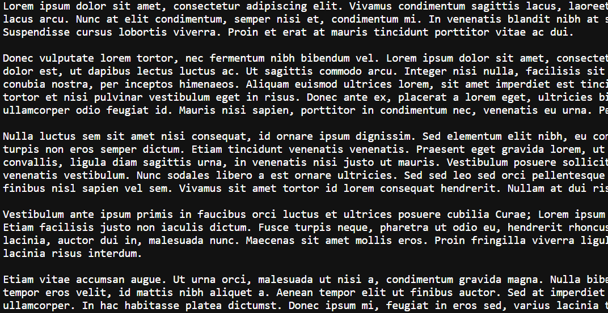

# Ejercicio 4

Descargar un archivo de texto y mostrar su contenido

### Respuesta 

```javascript
async function fetchTextFile() {
  try {
    const response = await fetch('https://example.com/sample.txt'); 
    const blob = await response.blob();
    const text = await blob.text();
    console.log('Contenido del archivo de texto:', text);
  } catch (error) {
    console.error('Error al cargar el archivo de texto:', error);
  }
}

fetchTextFile();
```
### Explicación:

- fetch('https://example.com/sample.txt'): Solicita un archivo de texto (cambia la URL por una válida).
- response.blob(): Obtiene el blob de la respuesta.
- blob.text(): Convierte el blob en texto.
- console.log(...): Muestra el contenido del archivo de texto en la consola.

### Resultado


