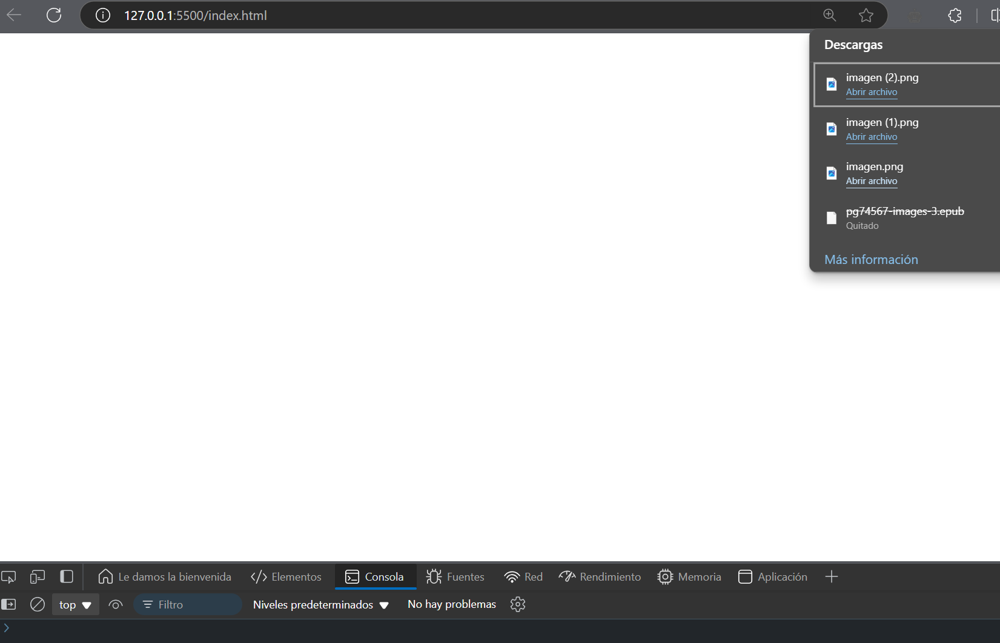

# Ejercicio 5

Descargar un archivo de imagen, convertirlo y descargarlo

### Respuesta 

```javascript
async function downloadImage() {
    try {
        const response = await fetch('https://api.allorigins.win/get?url=' + encodeURIComponent('https://via.placeholder.com/150'));
        const data = await response.json();
        const blob = await fetch(data.contents).then(res => res.blob());
        const url = URL.createObjectURL(blob);

        const a = document.createElement('a');
        a.href = url;
        a.download = 'imagen.png';
        document.body.appendChild(a);
        a.click();
        document.body.removeChild(a);
    } catch (error) {
        console.error('Error al descargar la imagen:', error);
    }
}

downloadImage();
```

# Explicación:

- fetch('https://via.placeholder.com/150'): Descarga la imagen.
- response.blob(): Obtiene el blob de la imagen.
- URL.createObjectURL(blob): Crea una URL para el blob.
- document.createElement('a'): Crea un enlace `(<a>)`.
- a.href = url: Establece la URL como el destino del enlace.
- a.download = 'imagen.png': Define el nombre del archivo a descargar.
- a.click(): Simula un clic en el enlace para iniciar la descarga.
- document.body.removeChild(a): Elimina el enlace del documento.

### Resultado


