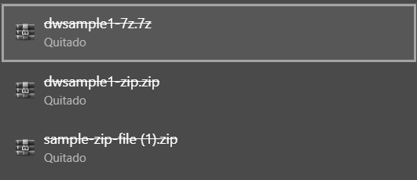

# Ejercicio 7

Obtener un archivo ZIP y extraer su contenido (solo mostrar el nombre)

### Respuesta 

```javascript
async function fetchZip() {
  try {
    const response = await fetch('https://example.com/sample.zip'); 
    const blob = await response.blob();
    const url = URL.createObjectURL(blob);
    
    console.log('Archivo ZIP disponible para descargar:', url);
  } catch (error) {
    console.error('Error al cargar el archivo ZIP:', error);
  }
}

fetchZip();
```

### Explicación:

- fetch('https://example.com/sample.zip'): Solicita un archivo ZIP (cambia la URL por una válida).
- response.blob(): Convierte la respuesta en un objeto Blob.
- URL.createObjectURL(blob): Crea una URL para el blob.
- console.log(...): Imprime la URL del archivo ZIP, indicando que está disponible para su descarga.


### Resultado


