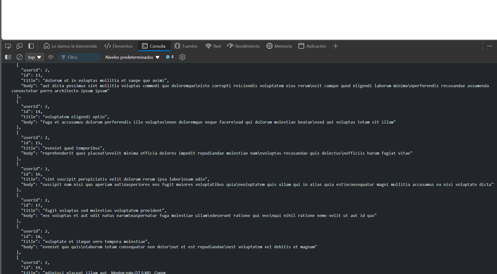

# Ejercicio 8

Descargar y guardar un archivo JSON

### Resultado 

```javascript
async function fetchJSON() {
  try {
    const response = await fetch('https://jsonplaceholder.typicode.com/posts');
    const blob = await response.blob();
    const json = await blob.text();
    console.log('Contenido JSON:', json);
  } catch (error) {
    console.error('Error al cargar el archivo JSON:', error);
  }
}

fetchJSON();
```

### Explicación:

- fetch('https://jsonplaceholder.typicode.com/posts'): Realiza una solicitud GET para obtener un archivo JSON.
- response.blob(): Obtiene el blob de la respuesta.
- blob.text(): Convierte el blob en texto.
- console.log('Contenido JSON:', json): Imprime el contenido del JSON en la consola.

### Resultado


