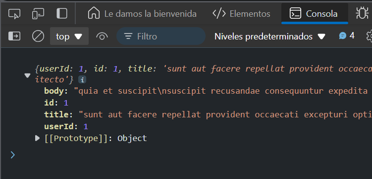

# Ejercicio 1
## GET Request con XMLHttpRequest
Objetivo: Realizar una solicitud GET básica utilizando XMLHttpRequest.


### Respuesta 

```
function getData() {
  const xhr = new XMLHttpRequest();
  xhr.open('GET', 'https://jsonplaceholder.typicode.com/posts/1');
  xhr.onload = function () {
    if (xhr.status === 200) {
      console.log(JSON.parse(xhr.responseText));
    } else {
      console.error('Error al obtener los datos');
    }
  };
  xhr.send();
}

getData();
```
### Explicacion 

- Este código usa la API `XMLHttpRequest` para hacer una solicitud GET a un recurso en una URL y manejar la respuesta.

### Resultado




