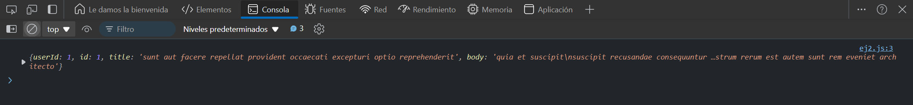

# Ejercicio 2
## GET Request con fetch
Objetivo: Utilizar la API fetch para hacer una solicitud GET.

### Respuesta 

```
fetch('https://jsonplaceholder.typicode.com/posts/1')
  .then(response => response.json())
  .then(data => console.log(data))
  .catch(error => console.error('Error:', error));

```

### Explicación:
- Con `fetch`, se puede realizar una solicitud GET de manera más sencilla y manejar la respuesta de forma promesa. El método `json()` convierte la respuesta en JSON.

### Resultado


