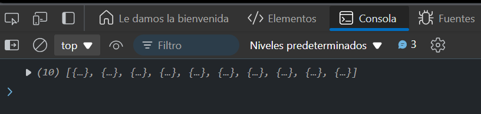

# Ejercicio 3

## GET Request con Parámetros de Consulta
Objetivo: Hacer una solicitud GET con parámetros de consulta (query parameters).

### Respuesta 

```
const userId = 2;
fetch(`https://jsonplaceholder.typicode.com/posts?userId=${userId}`)
  .then(response => response.json())
  .then(data => console.log(data))
  .catch(error => console.error('Error:', error));
```
### Explicación

- Este ejemplo usa los parámetros de consulta `userId` en la URL para filtrar los datos que obtenemos en la respuesta.

### Resultado


