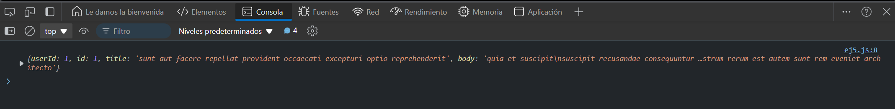

# Ejercicio 4

## GET Request con axios
Objetivo: Realizar una solicitud GET utilizando la librería axios.

### Resultado

```
<!DOCTYPE html>
<html lang="en">
<head>
    <meta charset="UTF-8">
    <meta name="viewport" content="width=device-width, initial-scale=1.0">
    <title>Document</title>
    <script src="https://cdn.jsdelivr.net/npm/axios/dist/axios.min.js"></script>
</head>
<body>
    <script src="GET requests/ej4.js"></script>
</body>
</html>
```

```
axios.get('https://jsonplaceholder.typicode.com/posts/1')
  .then(response => console.log(response.data))
  .catch(error => console.error('Error:', error));
```

### Explicación
- axios es una librería popular que simplifica la realización de peticiones HTTP. En este caso, hacemos un GET y accedemos a los datos de la respuesta.

### Resultado


