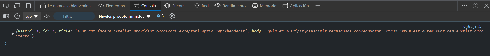

# Ejercicio 5
## GET Request con Headers Personalizados
Objetivo: Realizar una solicitud GET con headers personalizados usando fetch.

### Resultado

```
fetch('https://jsonplaceholder.typicode.com/posts/1', {
  headers: {
    'Authorization': 'Bearer my-token',
    'Content-Type': 'application/json'
  }
})
  .then(response => response.json())
  .then(data => console.log(data))
  .catch(error => console.error('Error:', error));
```

### Explicación:
- Aquí enviamos headers personalizados en la solicitud GET, por ejemplo, un token de autenticación.

### Resultado


