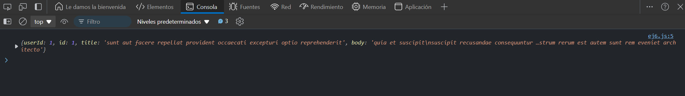

# Ejercicio 6
## GET Request con async/await
Objetivo: Realizar una solicitud GET usando async/await.

### Resultado

```
async function getData() {
  try {
    const response = await fetch('https://jsonplaceholder.typicode.com/posts/1');
    const data = await response.json();
    console.log(data);
  } catch (error) {
    console.error('Error:', error);
  }
}

getData();
```

### Explicación
- Este código utiliza `async/await` para hacer que la solicitud GET sea más legible. La solicitud se realiza de manera asíncrona.

### Resultado


