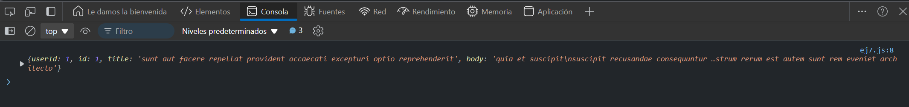

# Ejercicio 7
## GET Request con Manejo de Errores Avanzado
Objetivo: Hacer una solicitud GET con un manejo de errores más detallado.

### Resultado

```
fetch('https://jsonplaceholder.typicode.com/invalid-url')
  .then(response => {
    if (!response.ok) {
      throw new Error(`Error: ${response.status}`);
    }
    return response.json();
  })
  .then(data => console.log(data))
  .catch(error => console.error('Error:', error.message));
```
### Explicación: 

- Este ejemplo revisa el estado de la respuesta con response.ok y maneja errores HTTP como el `404`.

### Resultado


