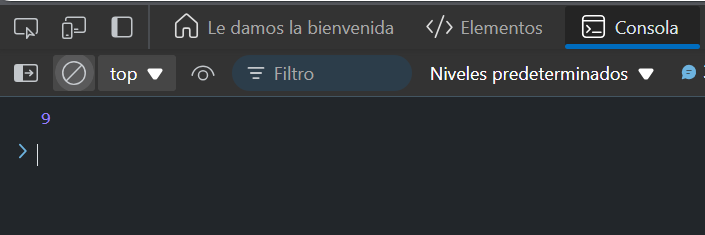

# Ejercicio 1

## Sumar dos números

Crea una función sum que toma dos números como argumentos y devuelve una promesa que resuelve con la suma de esos números. Encadena dos llamadas a sum para sumar tres números.

### Respuesta 

```
function sum(a, b) {
  return new Promise((resolve) => {
    setTimeout(() => {
      resolve(a + b);
    }, 1000);
  });
}

sum(2, 3)
  .then(result => sum(result, 4))
  .then(finalResult => console.log(finalResult));

```

### Explicación: 

- `sum(a, b)` es una función que devuelve una promesa que se resuelve con la suma de a y b después de un segundo (1000 ms).
- Primero se suma 2 + 3, y luego el resultado (5) se pasa a otra promesa para sumarlo con 4.
- Finalmente, console.log imprime 9 cuando se resuelve la segunda promesa.


### Resultado 


