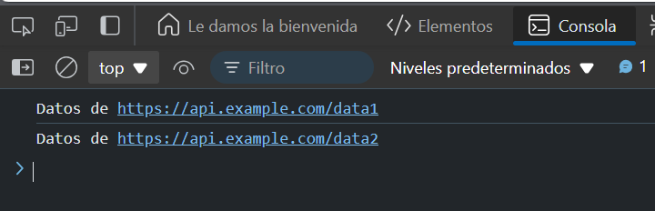

# Ejercicio 3 
## Obtener datos de un API
Crea una función fetchData que simule la obtención de datos de una API. Encadena dos llamadas para obtener dos conjuntos de datos diferentes.

### Respuesta


```
function fetchData(url) {
  return new Promise((resolve) => {
    setTimeout(() => {
      resolve(`Datos de ${url}`);
    }, 1000);
  });
}

// Uso
fetchData('https://api.example.com/data1')
  .then(data1 => {
    console.log(data1);
    return fetchData('https://api.example.com/data2');
  })
  .then(data2 => console.log(data2)); // Imprimirá ambos datos
```

### Explicación:

- `fetchData` simula la obtención de datos de una URL.
- Primero se obtienen datos de `data1` y luego, al resolver la primera promesa, se encadena otra llamada para obtener `data2`.
- Ambos datos se imprimen en la consola secuencialmente.

### Resultado 


