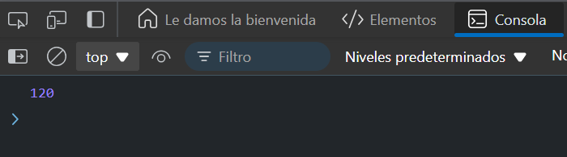

# Ejercicio 4 
## Realizar cálculos asíncronos
Crea una función multiply que multiplica dos números y devuelve una promesa. Encadena tres multiplicaciones.

### Resultado

```
function multiply(a, b) {
  return new Promise((resolve) => {
    setTimeout(() => {
      resolve(a * b);
    }, 1000);
  });
}

// Uso
multiply(2, 3)
  .then(result => multiply(result, 4))
  .then(finalResult => multiply(finalResult, 5))
  .then(finalResult => console.log(finalResult)); // Debería imprimir 120
```

### Explicación:
- `multiply` toma dos números, los multiplica y devuelve una promesa con el resultado.
- Multiplicamos 2 * 3 (6), luego ese resultado lo multiplicamos por 4 (24), y finalmente por 5, dando 120.
- El resultado final se imprime en la consola.
### Resultado 


