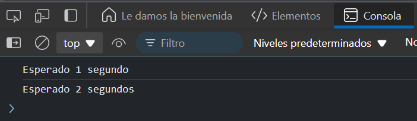

# Ejercicio 5
## Simular un retraso
Crea una función delay que espera un tiempo determinado antes de resolver. Encadena varias demoras para simular una secuencia de eventos.

### Resultado

```
function delay(ms) {
  return new Promise(resolve => setTimeout(resolve, ms));
}

// Uso
delay(1000)
  .then(() => {
    console.log('Esperado 1 segundo');
    return delay(2000);
  })
  .then(() => console.log('Esperado 2 segundos'));
```

### Explicación:

- `delay` es una función que simplemente espera un tiempo (ms) antes de resolver la promesa.
- Primero esperamos 1 segundo, imprimimos un mensaje, y luego esperamos 2 segundos adicionales antes de imprimir el siguiente mensaje.
- Esta técnica puede ser útil para simular temporizadores o retrasos en operaciones.

### Resultado 


