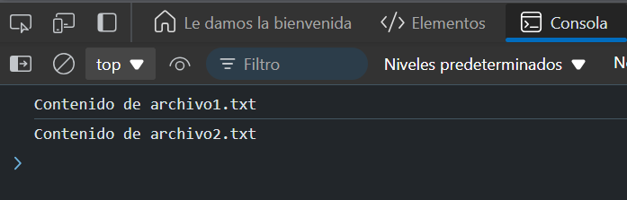

# Ejercicio 6
## Leer archivos (simulación)
Crea una función readFile que simule la lectura de un archivo y devuelve una promesa. Encadena dos lecturas de archivos.

### Respuesta 

```
function readFile(fileName) {
  return new Promise((resolve) => {
    setTimeout(() => {
      resolve(`Contenido de ${fileName}`);
    }, 1000);
  });
}

// Uso
readFile('archivo1.txt')
  .then(content1 => {
    console.log(content1);
    return readFile('archivo2.txt');
  })
  .then(content2 => console.log(content2)); // Imprimirá el contenido de ambos archivos
```
### Explicación:

- `readFile` simula la lectura de un archivo devolviendo una promesa con el contenido después de un segundo.
- Primero se lee `archivo1.txt` y luego, encadenamos otra llamada a readFile para leer `archivo2.txt`.
- Ambos contenidos se imprimen en orden.

### Resultado 


