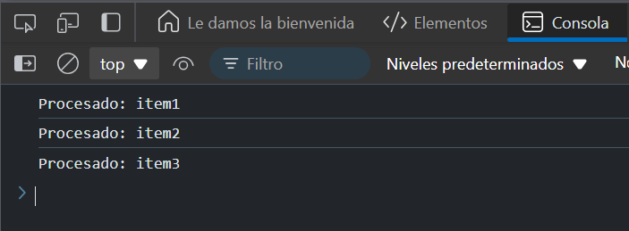

# Ejercicio 7 
## Procesar una lista
Crea una función processItem que simule el procesamiento de un elemento y devuelve una promesa. Encadena el procesamiento de varios elementos de una lista.

### Respuesta 

```
function processItem(item) {
  return new Promise((resolve) => {
    setTimeout(() => {
      resolve(`Procesado: ${item}`);
    }, 1000);
  });
}

// Uso
const items = ['item1', 'item2', 'item3'];

Promise.resolve()
  .then(() => processItem(items[0]))
  .then(result1 => {
    console.log(result1);
    return processItem(items[1]);
  })
  .then(result2 => {
    console.log(result2);
    return processItem(items[2]);
  })
  .then(result3 => console.log(result3));
```
### Explicación:
- `processItem` procesa un elemento de la lista devolviendo una promesa con el resultado.
- Procesamos cada uno de los elementos de la lista `items` de manera secuencial, asegurando que uno se procese antes de pasar al siguiente.
- Imprime cada elemento procesado en la consola.

### Resultado 


