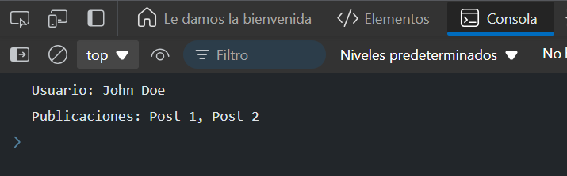

# Ejercicio 8
## Combinando resultados
Crea dos funciones getUser y getPosts que devuelvan promesas con información de un usuario y sus publicaciones. Encadena ambas funciones para mostrar la información combinada.

### Respuesta 
```
function getUser() {
  return new Promise((resolve) => {
    setTimeout(() => {
      resolve({ name: 'John Doe' });
    }, 1000);
  });
}

function getPosts() {
  return new Promise((resolve) => {
    setTimeout(() => {
      resolve(['Post 1', 'Post 2']);
    }, 1000);
  });
}

// Uso
getUser()
  .then(user => {
    console.log(`Usuario: ${user.name}`);
    return getPosts();
  })
  .then(posts => console.log(`Publicaciones: ${posts.join(', ')}`));
```

### Explicación:
- `getUser` simula la obtención de un usuario, y `getPosts` simula la obtención de sus publicaciones.
- Primero obtenemos la información del usuario y la imprimimos, y luego encadenamos la obtención de sus publicaciones, que también se imprimen.
- Las publicaciones se muestran en un formato amigable.


### Resultado 


