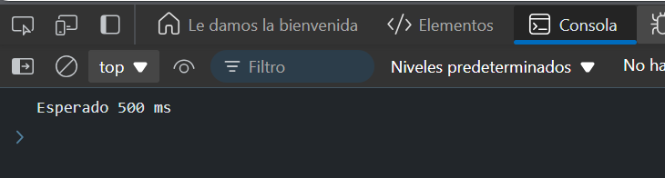

# Ejercicio 1

## Carrera de temporizadores
Objetivo: Usar Promise.race para esperar el temporizador que se complete más rápido.

### Respuesta
```
function delay(ms) {
  return new Promise((resolve) => {
    setTimeout(() => {
      resolve(`Esperado ${ms} ms`);
    }, ms);
  });
}


Promise.race([
  delay(1000), 
  delay(500), 
  delay(2000)
])
.then(result => console.log(result)) 
```
### Resultado




### Explicación:

- Tienes tres promesas que se resolverán después de 1000, 500, y 2000 milisegundos respectivamente.
- `Promise.race` devuelve el resultado de la promesa que se resuelve primero (en este caso, la que espera 500 ms).
