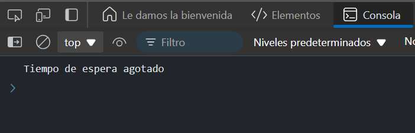

# Ejercicio 2
## Simular una conexión lenta
Objetivo: Simular la carrera entre una solicitud lenta de red y un temporizador para abortar la operación si tarda demasiado.

### Respuesta
```
function slowRequest() {
  return new Promise((resolve) => {
    setTimeout(() => {
      resolve('Datos recibidos de la solicitud lenta');
    }, 3000);
  });
}

function timeout(ms) {
  return new Promise((_, reject) => {
    setTimeout(() => {
      reject('Tiempo de espera agotado');
    }, ms);
  });
}

// Uso
Promise.race([
  slowRequest(), 
  timeout(2000)
])
.then(result => console.log(result))
.catch(error => console.log(error)); // Imprimirá: "Tiempo de espera agotado"
```
### Resultado 




### Explicación:

- La función `slowRequest` simula una solicitud que tarda 3 segundos en completarse.
- Si la solicitud no se completa en 2 segundos (definido por `timeout`), `Promise.race` rechaza la promesa con "Tiempo de espera agotado".