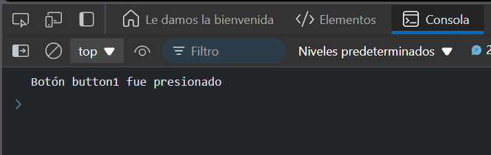

# Ejercicio 3
## Carrera de clics de botón
Objetivo: Usar Promise.race para detectar el primer botón que sea presionado por el usuario.

### Respuesta
```
<button id="button1">Botón 1</button>
<button id="button2">Botón 2</button>

<script src="ej3.js"></script>
```


```
function buttonClick(buttonId) {
  return new Promise((resolve) => {
    document.getElementById(buttonId).addEventListener('click', () => {
      resolve(`Botón ${buttonId} fue presionado`);
    });
  });
}

Promise.race([
  buttonClick('button1'),
  buttonClick('button2')
])
.then(result => console.log(result)); // Imprimirá el botón que fue presionado primero
```
### Resultado




### Explicación:

- Creamos una promesa que se resuelve cuando se hace clic en uno de los dos botones.
- `Promise.race` devolverá el mensaje del botón que sea presionado primero.
