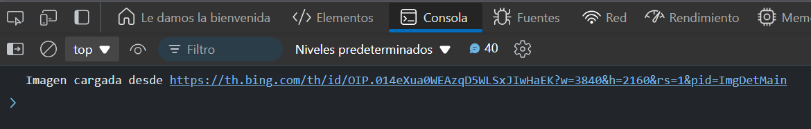

# Ejercicio 4
## Descarga de imágenes
Objetivo: Usar Promise.race para cargar la imagen que se descargue más rápido.
### Respuesta
```
function loadImage(url) {
  return new Promise((resolve, reject) => {
    const img = new Image();
    img.src = url;
    img.onload = () => resolve(`Imagen cargada desde ${url}`);
    img.onerror = () => reject(`Error al cargar imagen desde ${url}`);
  });
}

Promise.race([
  loadImage('https://example.com/image1.jpg'),
  loadImage('https://example.com/image2.jpg')
])
.then(result => console.log(result))
.catch(error => console.log(error));
```
### Resultado




### Explicación:

- `loadImage` devuelve una promesa que se resuelve cuando una imagen se carga con éxito.
- `Promise.race` devuelve el resultado de la primera imagen que se cargue, o el primer error si ocurre.