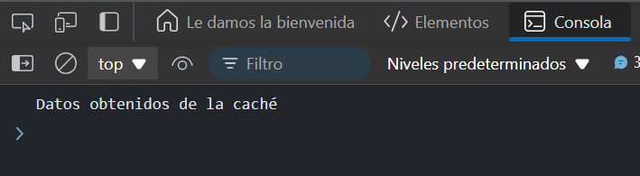

# Ejercicio 5
## Carrera entre API y caché
Objetivo: Usar Promise.race para obtener datos de una API o de la caché, lo que ocurra primero.

### Respuesta

```
function fetchFromAPI() {
  return new Promise((resolve) => {
    setTimeout(() => {
      resolve('Datos obtenidos de la API');
    }, 3000); // Simulando una API lenta
  });
}

function fetchFromCache() {
  return new Promise((resolve) => {
    setTimeout(() => {
      resolve('Datos obtenidos de la caché');
    }, 1000); // Simulando que la caché es más rápida
  });
}

Promise.race([
  fetchFromAPI(),
  fetchFromCache()
])
.then(result => console.log(result)); 
```
### Resultado



### Explicación:

- `fetchFromAPI` simula una llamada lenta a una API, mientras que `fetchFromCache` simula una respuesta rápida desde la caché.
- `Promise.race` devolverá los datos de la caché primero, ya que es más rápida.