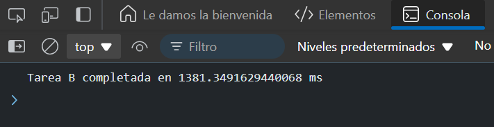

# Ejercicio 8
## Simulación de tareas múltiples
Objetivo: Usar Promise.race para simular la finalización de una tarea aleatoria.

### Respuesta
```
function randomTask(name, time) {
  return new Promise((resolve) => {
    setTimeout(() => {
      resolve(`Tarea ${name} completada en ${time} ms`);
    }, time);
  });
}

Promise.race([
  randomTask('A', Math.random() * 3000),
  randomTask('B', Math.random() * 3000),
  randomTask('C', Math.random() * 3000)
])
.then(result => console.log(result)); 
```

### Resultado 



### Explicación:

- Tres tareas se ejecutan con tiempos aleatorios de entre 0 y 3000 milisegundos.
- `Promise.race` devuelve la tarea que se complete primero, sin importar cuál de ellas sea.
